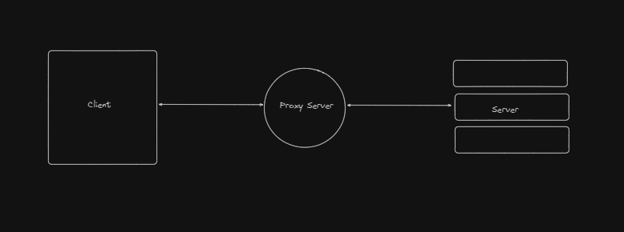
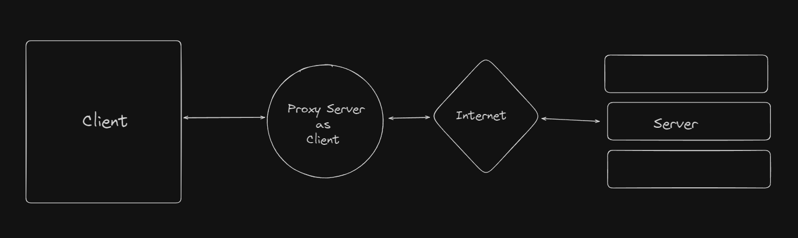
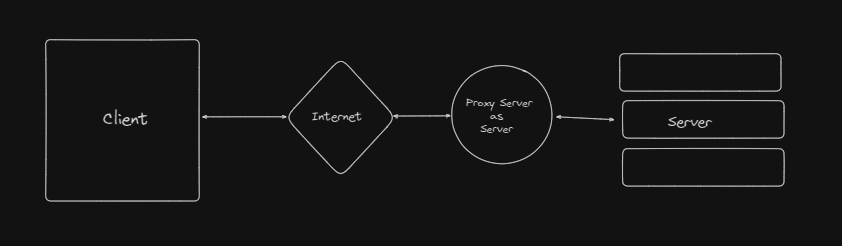
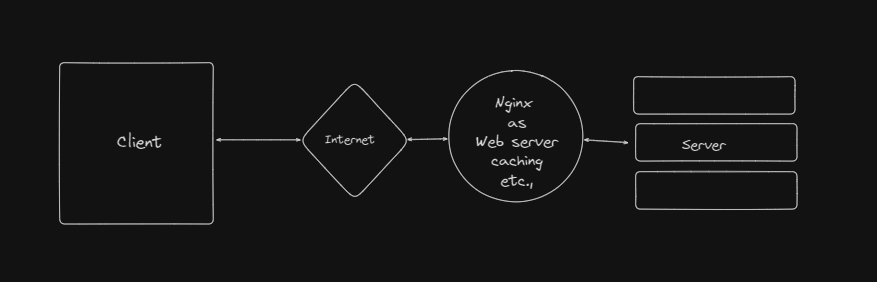
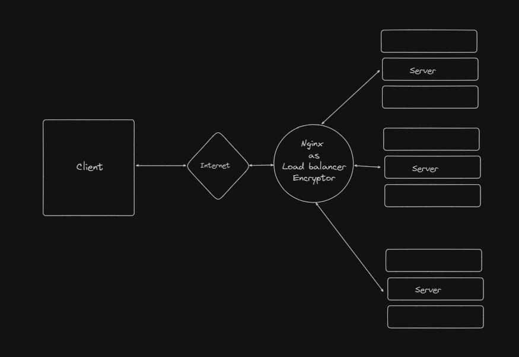

# Nginx

An popular open source server software which can be

- A reverve proxy
- A web server
- A load balancer
- A ssl encryptor for underlying server
- A Caching

## Reverse Proxy

### Proxy :

It is placing a intermediate server between client and server to improve security.



There are two types

- Forward Proxy
- Reverse proxy

#### Forward proxy :

- In this case proxy server act as a client instead the actual client when reaching internet to get some info
- Mostly used in school and organization to limit access to internet
- It provide saftey as we never disclose the IP or other details of underlying client so it difficult for some to track back to a actual client



#### Reverse proxy

- In this case it acts as a server on behalf of backend servers.
- It increase security by not revealing the actual IP / info about the underlying server



- A webserver and caching

  - It will help to server static content like image and html pages
  - It will cache data in it so that for similar request it will give the cached data without making another API call to backend.



- A Load balancer and Encryptor
  - It acts as load balancer which help to redirect request among different instance of a server to get data.
  - As SSL handshake or encryption in case of https require large computation so it take the burden of that in it so no need to have SSL handshake in every server behind it



## Nginx syntax

```
context {
    // directives
}
```

- Directive : argument or configuration data for the server
- Context : block or Group of directive that are related

## Code Sample

The code sample for the below with explaination will be found in [nginx.config](./nginx%20config/conf/nginx.conf)

- [Making a HTTP server](./nginx%20config/conf/nginx.conf#L1)
- [Serving static content](./nginx%20config/conf/nginx.conf#L12)
- [Serving Different format file](./nginx%20config/conf/nginx.conf#L29)
- [Redirect and rewrite](./nginx%20config/conf/nginx.conf#L30)
- [Load balancing using a simple endpoints](./nginx%20config/conf/nginx.conf#L79)

```
Load balancing using a simple endpoints

Docker setup

1. move to server folder under code [link](./code/server/).
2. run docker build . -t demo-server.
3. look the explanation in the config file.
```

### Nginx command

- nginx -s start : to start server
- nginx -s reload : to reload the changes when server running
- nginx -s stop : to stop running server
